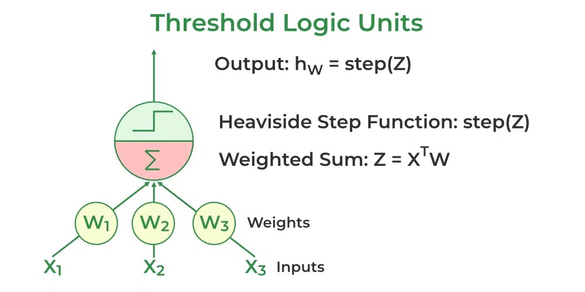

# Perceptron

**NOTE**: Explanations made with AI



## What is a Perceptron?

The perceptron is the simplest neural classifier for binary classification (two classes). It works like a biological neuron: it takes multiple inputs, weighs them, sums them up, and then makes a binary decision using a hard threshold.

## How Does It Work?

### The Model

The perceptron computes a weighted sum of inputs:
$$z = \mathbf{w}^\top \mathbf{x} + b$$

- **$\mathbf{x}$** = input features (e.g., $[x_1, x_2, x_3]$)
- **$\mathbf{w}$** = weights that determine the importance of each input
- **$b$** = bias term (shifts the decision boundary)
- **$z$** = the raw weighted sum

Then, it applies a hard threshold (step function): If $z \geq 0$, output 1; otherwise output 0

This produces a binary output: either 0 or 1. The **decision boundary** is the line (or hyperplane in higher dimensions) where $z = 0$, i.e., $\mathbf{w}^\top \mathbf{x} + b = 0$.

### Training (Perceptron Learning Rule)

The perceptron learns by adjusting weights when it makes mistakes. Here's the algorithm:

1. **Initialize**: Set $\mathbf{w}$ and $b$ to zeros and pick a small learning rate $\eta > 0$ (e.g., 0.1).

2. **For each training example** $(\mathbf{x}, y)$ where $y$ is the true label (0 or 1):

   - Compute prediction: $\hat{y} = \text{step}(\mathbf{w}^\top\mathbf{x} + b)$
   - Calculate error: $e = y - \hat{y}$ (this is 0 if correct, +1 or -1 if wrong)
   - **Update weights**: $\mathbf{w} \leftarrow \mathbf{w} + \eta \, e \, \mathbf{x}$ — nudge weights in the direction of the correct answer
   - **Update bias**: $b \leftarrow b + \eta \, e$ — adjust the threshold slightly

3. **Repeat**: Go through all training data for multiple epochs (iterations) until no mistakes are made, or a maximum epoch limit is reached.

**Key idea**: When the perceptron makes a mistake, it updates the weights proportionally to the error. If it predicts 0 but should be 1 ($e = +1$), it increases weights; if it predicts 1 but should be 0 ($e = -1$), it decreases weights.

## Worked Example: AND Gate

Let's train a perceptron to learn the AND gate logic. The AND gate returns 1 only when both inputs are 1.

### Training Data

| $x_1$ | $x_2$ | $y$ (AND output) |
| ----- | ----- | ---------------- |
| 0     | 0     | 0                |
| 0     | 1     | 0                |
| 1     | 0     | 0                |
| 1     | 1     | 1                |

### Initialization

- $\mathbf{w} = [0, 0]$ (start with zero weights)
- $b = 0$ (start with zero bias)
- $\eta = 0.5$ (learning rate)

### Training Step-by-Step

**Epoch 1, Example 1:** $\mathbf{x} = [0, 0]$, $y = 0$

We want to classify the input $[0, 0]$ and the true label is $y = 0$ (AND gate: 0 AND 0 = 0).

1. **Compute weighted sum:** Apply the formula $z = w_1 \cdot x_1 + w_2 \cdot x_2 + b$

   - $z = 0 \cdot 0 + 0 \cdot 0 + 0 = 0$
   - We get $z = 0$, which is our raw "activation" — how strong the signal is.

2. **Apply step function:** Now we apply the decision rule: "If $z \geq 0$, output 1; otherwise output 0"

   - Since $z = 0$ and $0 \geq 0$ is TRUE, we output: $\hat{y} = \text{step}(0) = 1$
   - **The perceptron predicted 1**, but this is WRONG! The true label is 0.

3. **Calculate error:** Compare prediction to truth:

   - $e = y - \hat{y} = 0 - 1 = -1$
   - Error of $-1$ means: "we predicted too high; we need to lower our predictions"

4. **Update weights:** Use the rule $\mathbf{w} \leftarrow \mathbf{w} + \eta \, e \, \mathbf{x}$

   - $w_1 \leftarrow 0 + 0.5 \cdot (-1) \cdot 0 = 0 - 0 = 0$ (no change since $x_1 = 0$)
   - $w_2 \leftarrow 0 + 0.5 \cdot (-1) \cdot 0 = 0 - 0 = 0$ (no change since $x_2 = 0$)
   - When inputs are 0, they don't carry the error signal, so weights stay the same.

5. **Update bias:** Use the rule $b \leftarrow b + \eta \, e$
   - $b \leftarrow 0 + 0.5 \cdot (-1) = 0 - 0.5 = -0.5$
   - **This is key:** The bias decreases. A lower bias makes the step function output 0 more often (raises the activation threshold).

**After example 1:** $\mathbf{w} = [0, 0]$, $b = -0.5$

**Epoch 1, Example 2:** $\mathbf{x} = [0, 1]$, $y = 0$

True label is $y = 0$ (AND gate: 0 AND 1 = 0).

1. **Compute weighted sum:**

   - $z = 0 \cdot 0 + 0 \cdot 1 + (-0.5) = 0 + 0 - 0.5 = -0.5$
   - The activation is negative now (because of the lowered bias).

2. **Apply step function:** Check the rule: "If $z \geq 0$, output 1; otherwise output 0"

   - Since $z = -0.5$ and $-0.5 \geq 0$ is FALSE, we output: $\hat{y} = \text{step}(-0.5) = 0$
   - **The perceptron predicted 0**, which is CORRECT! The true label is also 0. ✓

3. **Calculate error:**

   - $e = y - \hat{y} = 0 - 0 = 0$
   - No error! The prediction matches the truth.

4. **Update weights:** Since $e = 0$, nothing happens:

   - $w_1 \leftarrow 0 + 0.5 \cdot 0 \cdot 0 = 0$ (no change)
   - $w_2 \leftarrow 0 + 0.5 \cdot 0 \cdot 1 = 0$ (no change)

5. **Update bias:** Since $e = 0$:
   - $b \leftarrow -0.5 + 0.5 \cdot 0 = -0.5$ (no change)

**After example 2:** $\mathbf{w} = [0, 0]$, $b = -0.5$ (unchanged)

**Epoch 1, Example 3:** $\mathbf{x} = [1, 0]$, $y = 0$

True label is $y = 0$ (AND gate: 1 AND 0 = 0).

1. **Compute weighted sum:**

   - $z = 0 \cdot 1 + 0 \cdot 0 + (-0.5) = 0 + 0 - 0.5 = -0.5$
   - Again, activation is negative due to the bias.

2. **Apply step function:** Check the rule: "If $z \geq 0$, output 1; otherwise output 0"

   - Since $z = -0.5$ and $-0.5 \geq 0$ is FALSE, we output: $\hat{y} = \text{step}(-0.5) = 0$
   - **The perceptron predicted 0**, which is CORRECT! ✓

3. **Calculate error:**

   - $e = 0 - 0 = 0$ (no error)

4. **No updates needed** since $e = 0$.

**After example 3:** $\mathbf{w} = [0, 0]$, $b = -0.5$ (unchanged)

**Epoch 1, Example 4:** $\mathbf{x} = [1, 1]$, $y = 1$

True label is $y = 1$ (AND gate: 1 AND 1 = 1).

1. **Compute weighted sum:**

   - $z = 0 \cdot 1 + 0 \cdot 1 + (-0.5) = 0 + 0 - 0.5 = -0.5$
   - The activation is still $-0.5$ because both weights are zero.

2. **Apply step function:** Check the rule: "If $z \geq 0$, output 1; otherwise output 0"

   - Since $z = -0.5$ and $-0.5 \geq 0$ is FALSE, we output: $\hat{y} = \text{step}(-0.5) = 0$
   - **The perceptron predicted 0**, but this is WRONG! The true label is 1. ✗

3. **Calculate error:**

   - $e = y - \hat{y} = 1 - 0 = 1$
   - Error of $+1$ means: "we predicted too low; we need to increase our predictions"

4. **Update weights:** Use the rule $\mathbf{w} \leftarrow \mathbf{w} + \eta \, e \, \mathbf{x}$

   - $w_1 \leftarrow 0 + 0.5 \cdot 1 \cdot 1 = 0 + 0.5 = 0.5$ (increase because $x_1 = 1$ carries the error)
   - $w_2 \leftarrow 0 + 0.5 \cdot 1 \cdot 1 = 0 + 0.5 = 0.5$ (increase because $x_2 = 1$ carries the error)
   - **Both weights increased:** This boosts the activation when both inputs are 1.

5. **Update bias:** Use the rule $b \leftarrow b + \eta \, e$
   - $b \leftarrow -0.5 + 0.5 \cdot 1 = -0.5 + 0.5 = 0$
   - **The bias goes back to 0:** We lower the threshold again so that [1, 1] can activate.

**After example 4 (end of Epoch 1):** $\mathbf{w} = [0.5, 0.5]$, $b = 0$

### What Happened?

- **When the perceptron made a mistake on $[0, 0]$**: It predicted 1 but should have predicted 0, so we decreased the bias ($b$). This raises the threshold, making it harder to predict 1.
- **When it made a mistake on $[1, 1]$**: It predicted 0 but should have predicted 1, so we increased both weights. This strengthens the response to the inputs [1, 1].
- After one epoch, the perceptron has learned weights $\mathbf{w} = [0.5, 0.5]$ and $b = 0$, which correctly separates the AND gate: the decision boundary is at $0.5x_1 + 0.5x_2 = 0$, or equivalently, $x_1 + x_2 = 0$ (in normalized form).

With more epochs, the weights would stabilize and all training examples would be classified correctly.

## Properties and Limitations

- **Convergence**: Converges to a separating hyperplane if and only if the data is linearly separable.
- **Hard decisions**: Produces hard class decisions (no probabilities); order of samples can affect the found solution.
- **Linear limitation**: Cannot learn non-linearly separable problems (e.g., XOR). The step activation is non-differentiable; modern neural networks use differentiable activations and gradient-based training.

See the example implementation in [Perceptron/perceptron.py](/Perceptron/perceptron.py)

---

## Why a Single Perceptron Cannot Solve XOR

### The XOR Problem

The XOR (exclusive OR) gate is a fundamental logical operation that outputs 1 only when the inputs are different:

| $x_1$ | $x_2$ | $y$ (XOR output) |
| ----- | ----- | ---------------- |
| 0     | 0     | 0                |
| 0     | 1     | 1                |
| 1     | 0     | 1                |
| 1     | 1     | 0                |

**Key observation**: XOR returns 1 when inputs differ (0,1) or (1,0), but returns 0 when inputs are the same (0,0) or (1,1).

### What Does a Single Perceptron Do?

A single perceptron creates a **linear decision boundary**. Mathematically, this is the equation:

$$w_1 x_1 + w_2 x_2 + b = 0$$

This represents a **straight line** in 2D space (or a hyperplane in higher dimensions). The perceptron divides the input space into two regions:

- **One side of the line**: All points here get classified as 0
- **Other side of the line**: All points here get classified as 1

Think of it like drawing a single straight line on a piece of paper to separate two groups of dots.

### Why XOR is Impossible for a Single Line

Let's plot the XOR truth table on a 2D plane:

```
    x2
    1   ●(1,1)→0    ○(0,1)→1

    0   ○(1,0)→1    ●(0,0)→0
        0           1         x1
```

Where:

- **○ (circles)** = Points that should output 1
- **● (filled dots)** = Points that should output 0

**The problem**: The two circles (1s) are at **opposite corners**, and the two filled dots (0s) are at the **other opposite corners**.

**Try to draw a single straight line that separates circles from filled dots.** You cannot do it! No matter how you position or angle a straight line:

- Any line that puts (0,1) on the "1" side will also incorrectly include either (0,0) or (1,1)
- Any line that puts (1,0) on the "1" side will also incorrectly include either (0,0) or (1,1)

This is called **non-linear separability** — the data cannot be separated by a single straight line.

### Mathematical Proof

Let's try to find weights that would work. We need:

1. For $(0,0) \rightarrow 0$: $w_1(0) + w_2(0) + b < 0 \implies b < 0$
2. For $(0,1) \rightarrow 1$: $w_1(0) + w_2(1) + b \geq 0 \implies w_2 + b \geq 0$
3. For $(1,0) \rightarrow 1$: $w_1(1) + w_2(0) + b \geq 0 \implies w_1 + b \geq 0$
4. For $(1,1) \rightarrow 0$: $w_1(1) + w_2(1) + b < 0 \implies w_1 + w_2 + b < 0$

From (2): $w_2 \geq -b$  
From (3): $w_1 \geq -b$  
Adding these: $w_1 + w_2 \geq -2b$

But from (1): $b < 0$, so $-2b > 0$, which means $w_1 + w_2 > 0$

From (4): $w_1 + w_2 + b < 0$

Combining: $w_1 + w_2 > 0$ and $w_1 + w_2 < -b$ and $-b > 0$

This creates: $w_1 + w_2 > 0$ and $w_1 + w_2 < -b$ with $-b > 0$

From (2) and (3): $w_1 + w_2 \geq -2b$ (positive value)  
From (4): $w_1 + w_2 < -b$ (must be negative since $b < 0$)

This is a **contradiction**: We need $w_1 + w_2$ to be both positive (from conditions 2 and 3) and negative (from condition 4). **Impossible!**

### What This Means

A single perceptron has **fundamental limitations**:

1. **Geometric limitation**: Can only create linear (straight-line) decision boundaries
2. **Cannot model complex patterns**: Any pattern requiring curved, circular, or multiple boundaries is impossible
3. **XOR is the simplest non-linear problem**: If a perceptron can't solve XOR, it can't solve any non-linear problem

### The Solution: Multiple Perceptrons (Neural Networks)

To solve XOR, you need **at least 2 perceptrons in a hidden layer** plus an output perceptron:

**Architecture:**

```
Input Layer (2)  →  Hidden Layer (2)  →  Output Layer (1)
   x1, x2               h1, h2                  y
```

**How it works:**

1. **First hidden perceptron (h1)**: Learns to recognize one pattern (e.g., when $x_1 + x_2 \geq 1$)
2. **Second hidden perceptron (h2)**: Learns to recognize another pattern (e.g., when $x_1 + x_2 \leq 1$)
3. **Output perceptron**: Combines h1 and h2 to produce the final XOR output

By combining multiple linear boundaries from different perceptrons, we can create **non-linear decision regions** that solve XOR and much more complex problems.

**This is why deep neural networks work**: They stack multiple layers of perceptrons (neurons) to create increasingly complex, non-linear decision boundaries that can solve problems far beyond what a single perceptron can handle.

### Key Takeaway

The inability of a single perceptron to solve XOR was a major discovery in the 1960s that temporarily halted neural network research. It revealed that:

- **Single perceptrons are limited** to linearly separable problems
- **Multiple layers are essential** for solving real-world, non-linear problems
- **Modern deep learning exists** precisely because we learned to train networks with many layers of perceptrons working together

This limitation is not a flaw — it's a fundamental property of linear classifiers. Understanding it helps us appreciate why modern neural networks need depth and complexity.
